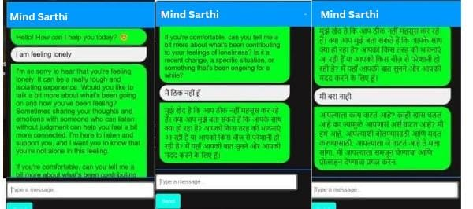
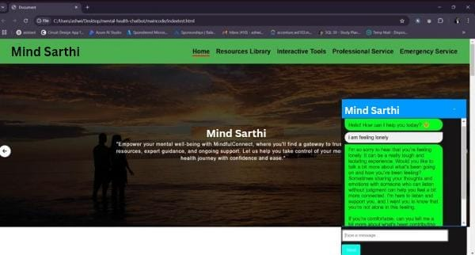
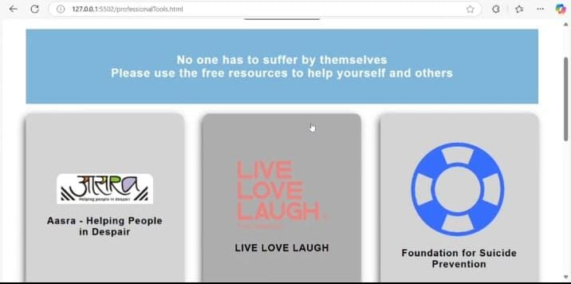
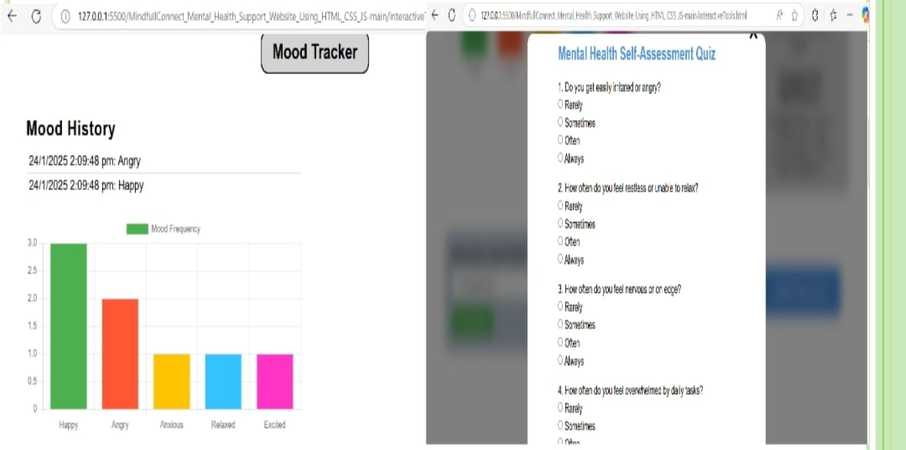
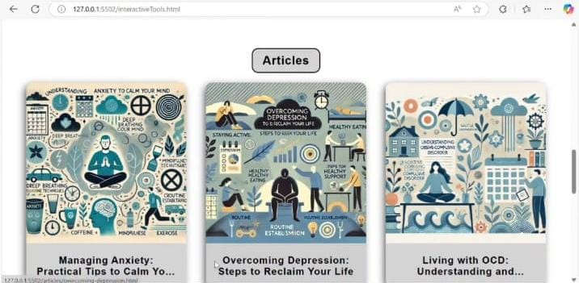

# MindSaarthi: Mental Health Support  Platform

## Overview
MindSaarthi a user-friendly, multilingual mental health support platform to deliver empathetic, human-like response. Beyond conversational support, MindSaarthi includes interactive tools like a mood tracker, mental health quizzes, emergency helpline access, curated podcast videos, a resource library, and informative articles. Designed for accessibility and emotional well-being, it offers a safe and supportive digital space for users..

## Demo

## Key Features
1. **Responsive Navigation Bar**: Designed to work seamlessly across desktops, tablets, and mobile devices.
2. **Interactive Mood Tracker**: Allows users to log and track their emotions over time, with tailored recommendations for improving mental well-being.
3. **Resource Library**: Divided into categories such as anxiety, stress, depression, and mindfulness. Contains articles, videos, and podcasts.
4. **Professional Services Directory**: Connects users to licensed therapists and mental health professionals.
5. **Emergency Support**: Provides essential hotline numbers and live chat integration (via Tawk.to) for immediate assistance.
6. **Quiz Modal**: Engages users in self-assessment quizzes that offer insights into their mental health. The quiz provides personalized feedback based on user responses and helps identify mood types like Happy, Anxious, or Sad. It also offers recommendations for improving mental well-being, such as meditation exercises.

## Tools and Technologies
- **HTML, CSS, JavaScript**: Frontend development.
- **Swiper.js**: For creating dynamic, responsive carousels on the homepage.
- **Tawk.to**: For live chat integration, enabling real-time support.
- **JavaScript (Quiz Modal)**: Powers the interactive quiz feature that selects 10 random questions from a set of 25 to assess the user’s mental health state.

<h3>Screenshots</h3>

  
  
  
  
  

